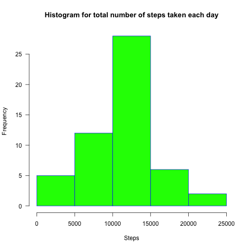
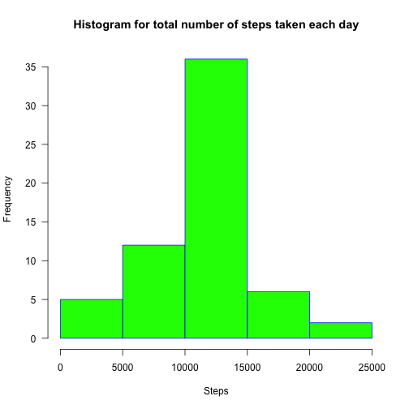
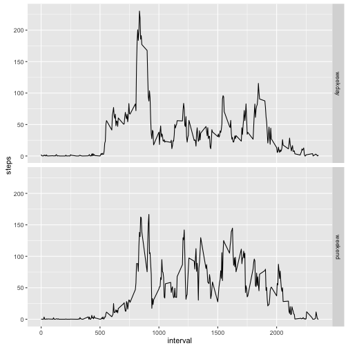

## Assignement
#Loading and preprocessing the data
1. Loading the data

```r
path <- "~/Downloads/activity.csv"
data <- read.csv(path)
library(ggplot2)
summary(data)
```

```
##      steps                date          interval     
##  Min.   :  0.00   2012-10-01:  288   Min.   :   0.0  
##  1st Qu.:  0.00   2012-10-02:  288   1st Qu.: 588.8  
##  Median :  0.00   2012-10-03:  288   Median :1177.5  
##  Mean   : 37.38   2012-10-04:  288   Mean   :1177.5  
##  3rd Qu.: 12.00   2012-10-05:  288   3rd Qu.:1766.2  
##  Max.   :806.00   2012-10-06:  288   Max.   :2355.0  
##  NA's   :2304     (Other)   :15840
```
2. Process/transform the data (if necessary) into a format suitable for your analysis

```r
data_tidy <- data[!is.na(data$steps),]
head(data_tidy)
```

```
##     steps       date interval
## 289     0 2012-10-02        0
## 290     0 2012-10-02        5
## 291     0 2012-10-02       10
## 292     0 2012-10-02       15
## 293     0 2012-10-02       20
## 294     0 2012-10-02       25
```
#What is mean of total number of steps taken per day?
For this part of the assignement the missing values are ignored.
1. Total number of steps taken per day

```r
total_steps <- aggregate(data_tidy$steps, by = list(date = data_tidy$date), FUN = sum)
head(total_steps)
```

```
##         date     x
## 1 2012-10-02   126
## 2 2012-10-03 11352
## 3 2012-10-04 12116
## 4 2012-10-05 13294
## 5 2012-10-06 15420
## 6 2012-10-07 11015
```

Renaming the second column as number of steps:

```r
names(total_steps)[2] <- "steps"
```

2. Histogram of the total number of steps taken each day

```r
hist(total_steps$steps,     main="Histogram for total number of steps taken each day",     xlab="Steps",     border="blue",     col="green",     las=1)
```



3. Mean and median of the total number of steps taken per day
Mean of the total number of steps taken per day

```r
mean(total_steps$steps)
```

```
## [1] 10766.19
```

Median of the total number of steps taken per day

```r
median(total_steps$steps)
```

```
## [1] 10765
```

# What is the average daily activity pettern?
1. Plot of the 5-minute interval (x-axis) and the average number of steps taken, averaged across all days (y-axis)

```r
mean_steps <- aggregate(data_tidy$steps, by = list(interval = data_tidy$interval), FUN = mean)
names(mean_steps)[2] <- "steps"
with(mean_steps,plot(interval,steps,type = "l"))
```


2. The interval contains the maximum number of steps, on average across all the days in the dataset.

```r
mean_steps[max(mean_steps$steps),]
```

```
##     interval    steps
## 206     1705 56.30189
```

# Imputing missing values
As it is obvious in "data", there are a number of days/intervals where there are missing values (coded as 𝙽𝙰). The presence of missing days may introduce bias into some calculations or summaries of the data.

```r
summary(data)
```

```
##      steps                date          interval     
##  Min.   :  0.00   2012-10-01:  288   Min.   :   0.0  
##  1st Qu.:  0.00   2012-10-02:  288   1st Qu.: 588.8  
##  Median :  0.00   2012-10-03:  288   Median :1177.5  
##  Mean   : 37.38   2012-10-04:  288   Mean   :1177.5  
##  3rd Qu.: 12.00   2012-10-05:  288   3rd Qu.:1766.2  
##  Max.   :806.00   2012-10-06:  288   Max.   :2355.0  
##  NA's   :2304     (Other)   :15840
```

1. Total number of missing values in dataset

```r
sum(is.na(data$steps))
```

```
## [1] 2304
```

2. Strategy for filling in all of the missing values in the dataset is to use the mean for that 5-minute interval.
3. Dataset that is equal to the original dataset but with the missing data filled in.

```r
data2 <- data
if ((data2[is.na(data2$steps),])$interval == mean_steps$interval) {data2[is.na(data2$steps),]$steps = mean_steps$steps}
```

```
## Warning in if ((data2[is.na(data2$steps), ])$interval == mean_steps
## $interval) {: the condition has length > 1 and only the first element will
## be used
```

```r
head(data2)
```

```
##       steps       date interval
## 1 1.7169811 2012-10-01        0
## 2 0.3396226 2012-10-01        5
## 3 0.1320755 2012-10-01       10
## 4 0.1509434 2012-10-01       15
## 5 0.0754717 2012-10-01       20
## 6 2.0943396 2012-10-01       25
```

4. Histogram of the total number of steps taken each day. 

```r
total_steps2 <- aggregate(data2$steps, by = list(date = data2$date), FUN = sum)
names(total_steps2)[2] <- "steps"
hist(total_steps2$steps,     main="Histogram for total number of steps taken each day",     xlab="Steps",     border="blue",     col="green",     las=1)
```



4. The mean and median total number of steps taken per day.

```r
mean(total_steps2$steps)
```

```
## [1] 10766.19
```

```r
median(total_steps2$steps)
```

```
## [1] 10766.19
```

As we can see there is no difference between the one without missing values.

# Are there differences in activity patterns between weekdays and weekends?

1. Createing a new factor variable in the dataset with two levels – “weekday” and “weekend” indicating whether a given date is a weekday or weekend day.

```r
data22 <- data2
data22$date <- as.Date(data22$date)
data22$date <- weekdays(data22$date)
data22$week.day <- ifelse(data22$date == "Saturday" | data22$date == "Sunday","weekend","weekday")
data22$week.day <- as.factor(data22$week.day)
head(data22)
```

```
##       steps   date interval week.day
## 1 1.7169811 Monday        0  weekday
## 2 0.3396226 Monday        5  weekday
## 3 0.1320755 Monday       10  weekday
## 4 0.1509434 Monday       15  weekday
## 5 0.0754717 Monday       20  weekday
## 6 2.0943396 Monday       25  weekday
```

2. Plot containing a time series plot (i.e. 𝚝𝚢𝚙𝚎 = "𝚕") of the 5-minute interval (x-axis) and the average number of steps taken, averaged across all weekday days or weekend days (y-axis)

```r
a22 <- aggregate(data22$steps, by = list(interval = data22$interval, week.day = data22$week.day), FUN = mean)
g <- ggplot(a22,aes(x=interval,y=x))
g + geom_line() + facet_grid(week.day~.) + labs(y = "steps")
```




